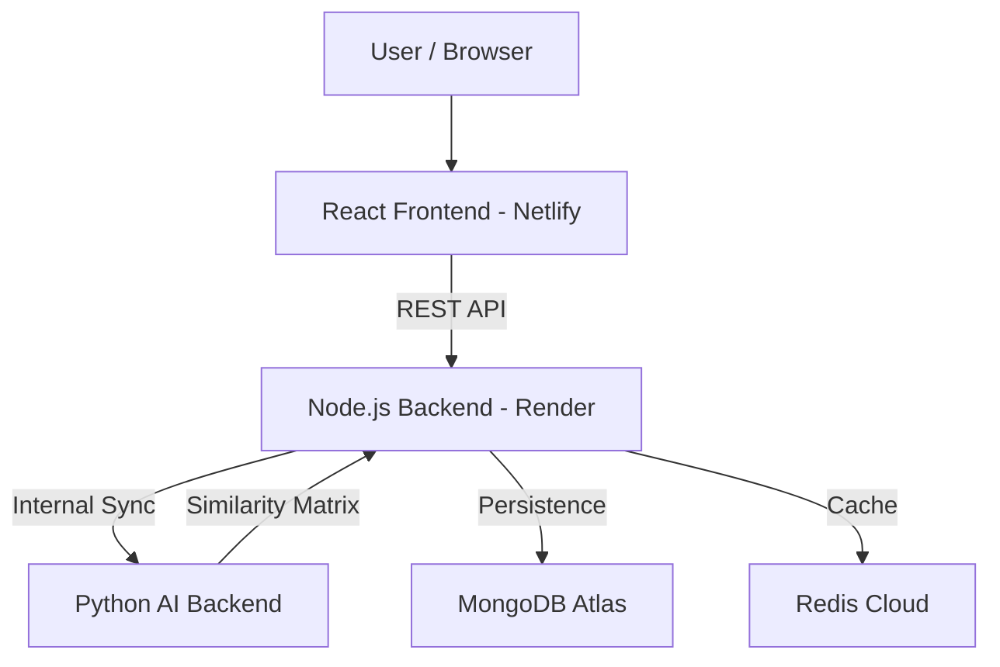

cd ..
# 🎬 MovieMind: AI-Powered Movie Recommendation System

MovieMind is a premium, full-stack cinematic platform that provides intelligent movie recommendations using Machine Learning. It features a stunning, animated React UI, a robust Node.js API gateway, and a Python-powered recommendation engine.

🌐 **Live Demo (Frontend)**: [MovieMind on Netlify](https://therdysmovierecommendationsystem.netlify.app/)

---

## ✨ Features

- 🔐 **Secure Authentication**: User registration and login flow with JWT.
- 🎥 **Smart Recommendations**: Similarity-based discovery using Python AI.
- 🎨 **Premium UI/UX**: Glassmorphism, dynamic gradients, and smooth Framer Motion animations.
- ⚡ **Performance Optimized**: Redis-based caching layer for lightning-fast repeated queries.
- 📱 **Fully Responsive**: Optimized for desktop, tablet, and mobile viewing.
- 🖼️ **TMDB Integration**: Dynamic fetching of high-quality movie posters and details.

---

## 🧱 Tech Stack

### Frontend
- **React.js** (Vite)
- **Tailwind CSS** (Styling)
- **Framer Motion** (Animations)
- **Lucide React** (Icons)
- **Netlify** (Deployment)

### Backend (API Gateway)
- **Node.js** & **Express.js**
- **MongoDB** (User Data & Favorites)
- **Redis** (Caching Logic)
- **Render** (Deployment)

### AI Backend
- **Python** (FastAPI/Flask)
- **Scikit-learn** (Cosine Similarity)
- **Pandas** (Dataset Processing)

---

## 📁 Project Structure

```text
moviemind/
├── frontend/          # React (Vite) application
├── node-backend/      # Node.js Express API & Auth layer
├── ai-backend/        # Python Recommendation Service
└── README.md
```

---

## 🔁 System Architecture



---

## 🚀 Getting Started

### 1. Prerequisites
- Node.js (v18+)
- Python (3.9+)
- MongoDB (Local or Atlas)
- Redis (Optional, for caching)

### 2. Environment Setup

#### Frontend (`frontend/.env`)
```env
VITE_TMDB_API_KEY=your_tmdb_key
VITE_API_BASE_URL=http://localhost:3000
```

#### Node Backend (`node-backend/.env`)
```env
PORT=3000
MONGO_URI=your_mongodb_uri
JWT_SECRET=your_secret_key
FASTAPI_URL=http://127.0.0.1:8000
REDIS_URL=your_redis_url  # Optional
```

### 3. Running Locally

**Start AI Backend:**
```bash
cd ai-backend
pip install -r requirements.txt
python app.py
```

**Start Node Backend:**
```bash
cd node-backend
npm install
npm run dev
```

**Start Frontend:**
```bash
cd frontend
npm install
npm run dev
```

---

## 🛡 Deployment

### Netlify (Frontend)
The frontend is pre-configured with a `netlify.toml` to handle secret scanning for environment variables.
- Ensure `VITE_API_BASE_URL` points to your Render backend.
- Ensure `VITE_TMDB_API_KEY` is added to Netlify Environment Variables.

### Render (Backend)
- Deploy `node-backend` as a Web Service.
- Deploy `ai-backend` as a Web Service (or Private Service).

---

## 🤝 Contributing

Contributions are welcome! Feel free to:
1. Fork the repo.
2. Create your feature branch (`git checkout -b feature/AmazingFeature`).
3. Commit your changes (`git commit -m 'Add some AmazingFeature'`).
4. Push to the branch (`git push origin feature/AmazingFeature`).
5. Open a Pull Request.

---

## ⭐ Support

If you find this project useful, please consider giving it a ⭐ on GitHub!

Built with ❤️ by **Ratna** & **Antigravity AI**.
