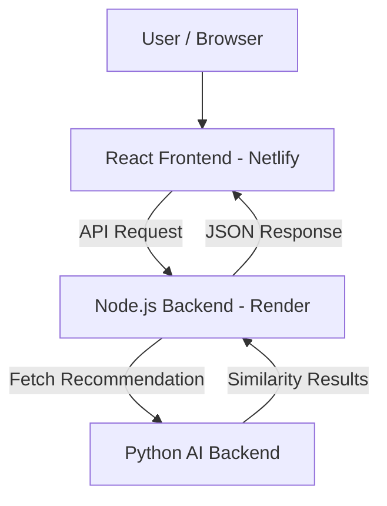

# 🎬 MovieMind

MovieMind is a **cinematic AI‑powered movie recommendation platform** with authentication, animated UI, and intelligent similarity‑based movie discovery. It is built using **React**, **Node.js**, and a **Python AI backend**, following modern UI/UX and full‑stack best practices.

🌐 **Live Demo (Frontend)**: [https://agent-698429ad8380623c8c--profound-gelato-4703f0.netlify.app/](https://agent-698429ad8380623c8c--profound-gelato-4703f0.netlify.app/)

---

## ✨ Features

* 🔐 User authentication (secure access flow)
* 🎥 AI‑powered movie recommendations based on similarity
* ⚡ Animated, cinematic UI/UX
* 🧠 Python‑based recommendation engine
* 🌍 Deployed frontend & backend (Netlify + Render)
* 🧩 Modular architecture (frontend, node backend, AI backend)

---

## 🧱 Tech Stack

### Frontend

* React.js
* Modern UI animations
* Deployed on **Netlify**

### Backend (API Gateway)

* Node.js
* Express.js
* Handles API routing & auth
* Deployed on **Render**

### AI Backend

* Python
* Similarity‑based recommendation logic
* Exposed via REST API

---

## 📁 Project Structure

```
moviemind/
│
├── frontend/          # React frontend (UI/UX)
├── node-backend/      # Node.js API layer
├── ai-backend/        # Python recommendation engine
│
├── package.json
├── README.md
└── LICENSE
```

---

## 🔁 System Architecture Diagram



### 🔍 Architecture Explanation

1. **User** interacts with the React frontend.
2. **Frontend** sends a request (movie name) to the Node.js backend.
3. **Node.js backend** acts as a bridge and API gateway.
4. **AI backend (Python)** processes similarity logic.
5. Recommendations are returned step‑by‑step back to the UI.

---

## 🚨 Known Issue: CORS Error

### ❌ Error Message

```
Access to XMLHttpRequest at
'https://moviemind-node-backend.onrender.com/api/recommend?movie=avatar'
from origin
'https://agent-698429ad8380623c8c--profound-gelato-4703f0.netlify.app'
has been blocked by CORS policy:
No 'Access-Control-Allow-Origin' header is present on the requested resource.
```

### 🧠 Why This Happens

* The **frontend (Netlify)** and **backend (Render)** are on different domains.
* The Node.js backend does **not allow cross‑origin requests** by default.
* Browser security blocks the API call.

---

## ✅ How to Fix the CORS Issue (Contribution Opportunity 👇)

### Solution: Enable CORS in Node.js Backend

Install CORS:

```bash
npm install cors
```

Update `index.js` / `app.js`:

```js
import cors from "cors";

app.use(cors({
  origin: "https://agent-698429ad8380623c8c--profound-gelato-4703f0.netlify.app",
  methods: ["GET", "POST"],
  credentials: true
}));
```

✔ This will allow the frontend to access backend APIs safely.

---

## 🤝 Contributing

Contributions are **highly welcome** 🚀

You can contribute by:

* Fixing the **CORS issue**
* Improving recommendation accuracy
* Enhancing UI/UX animations
* Adding authentication improvements
* Writing tests or documentation

### Steps to Contribute

1. Fork the repository
2. Create a new branch (`feature/fix-cors`)
3. Commit your changes
4. Open a Pull Request

---

## 🛡 License

This project is licensed under the **MIT License**.

---

## ⭐ Support

If you like this project:

* ⭐ Star the repository
* 🍴 Fork it
* 🧠 Suggest improvements

Built with passion for cinema & AI 🎥🤖
